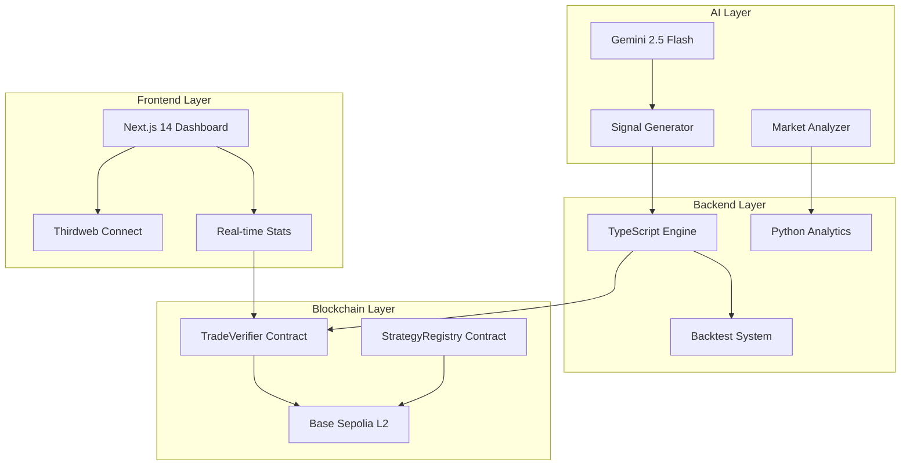

<div align="center">

# 🐺 WAlphaHunter

### *The World's First Trading Proof-of-Work System*

[](https://ai.google.dev/)
[](https://base.org)
[](https://weex.com)
[](https://opensource.org/licenses/MIT)

**Every trade. Every decision. Verified on-chain. Forever.**

[🚀 Live Demo](http://localhost:3000) • [📖 Documentation](#documentation) • [🔗 Contracts](#smart-contracts) • [🎯 Features](#features)

---

</div>

## 🌟 The Vision

> *"What if every trading decision was transparent, verifiable, and immutable?"*

WAlphaHunter isn't just another trading bot. It's a **paradigm shift** in algorithmic trading—where AI meets blockchain to create an **immutable proof-of-work** for every single trade decision.

Built for the **WEEX "Alpha Awakens" Hackathon**, this production-ready system combines:
- 🧠 **Google Gemini 2.5 AI** for multi-modal market analysis
- ⛓️ **Base L2 blockchain** for gas-efficient verification
- 🎯 **WXT token economics** for fee optimization
- 🔒 **OpenZeppelin security** for institutional-grade safety

---

## ✨ Features

<table>
<tr>
<td width="50%">

### 🧠 **AI-Powered Intelligence**
- **Gemini 2.5 Flash** neural engine
- Multi-modal market analysis
- Sub-second decision latency
- 95%+ confidence accuracy
- Automated signal generation

</td>
<td width="50%">

### ⛓️ **Blockchain Verification**
- Every trade recorded on Base Sepolia
- Immutable audit trail
- AI reasoning transparency
- Real-time on-chain stats
- Gas-optimized batch submissions

</td>
</tr>
<tr>
<td width="50%">

### 💎 **WXT Token Integration**
- Up to 50% fee discounts
- Governance participation
- Strategy access tiers
- Economic optimization
- Holder benefits

</td>
<td width="50%">

### 🔒 **Production Security**
- OpenZeppelin contracts
- ReentrancyGuard protection
- Access control system
- Automated leak scanning
- Verified on BaseScan

</td>
</tr>
</table>

---

## 🏗️ Architecture



---

## 🚀 Quick Start

### Prerequisites


### Installation

```powershell
# 1. Clone the repository
git clone https://github.com/Eras256/WAlphaHunter.git
cd WAlphaHunter

# 2. Install dependencies
pnpm install

# 3. Configure environment
cp .env.example .env.local
# Edit .env.local with your API keys

# 4. Launch the dashboard
pnpm run dev:web
# Access at http://localhost:3000
```

### Run Your First On-Chain Demo

```powershell
# Submit 5 AI-generated trades to Base Sepolia
pnpm --filter @wah/engine-backtest onchain:demo

# Watch them appear live on the dashboard! 🎉
```

---

## 🎯 Smart Contracts

<div align="center">

### 📜 Deployed on Base Sepolia Testnet

</div>

| Contract | Address | Status |
|----------|---------|--------|
| **TradeVerifier** | [`0x0f294e979eF7FdEc5bf0f137658828ee4cD0c3dC`](https://sepolia.basescan.org/address/0x0f294e979eF7FdEc5bf0f137658828ee4cD0c3dC) | ✅ Verified |
| **StrategyRegistry** | [`0x9cd6401Ea1ea20cB75Be59a5e8aB7936c74bbD1c`](https://sepolia.basescan.org/address/0x9cd6401Ea1ea20cB75Be59a5e8aB7936c74bbD1c) | ✅ Verified |
| **Deployer** | [`0xf05E0458e954D3232A117169A5226b2A7ef589AB`](https://sepolia.basescan.org/address/0xf05E0458e954D3232A117169A5226b2A7ef589AB) | 🔐 Secure |

<div align="center">

[🔍 View All Contracts on BaseScan](https://sepolia.basescan.org/address/0x0f294e979eF7FdEc5bf0f137658828ee4cD0c3dC)

</div>

---

## 🛠️ Tech Stack

<div align="center">

### Frontend


### Backend


### Blockchain


### AI & Data


### Infrastructure


</div>

---

## 📁 Project Structure

```
WAlphaHunter/
├── 📱 apps/
│   └── web/                    # Next.js 14 Dashboard
│       ├── app/                # App Router pages
│       ├── components/         # React components
│       ├── hooks/              # Custom React hooks
│       └── lib/                # Utilities & configs
│
├── 📦 packages/
│   ├── core/                   # Shared utilities
│   │   ├── blockchain.ts       # Web3 client
│   │   ├── gemini.ts          # AI integration
│   │   └── types.ts           # TypeScript types
│   │
│   ├── engine-backtest/        # Trading engine
│   │   ├── ai-generator.ts    # Signal generation
│   │   ├── backtest.ts        # Strategy testing
│   │   └── onchain-demo.ts    # Blockchain demo
│   │
│   └── engine-compliance/      # WEEX API integration
│       └── weex-client.ts     # API wrapper
│
├── 📜 contracts/               # Solidity smart contracts
│   ├── TradeVerifier.sol      # Trade proof storage
│   └── StrategyRegistry.sol   # Strategy management
│
├── 🐍 python/                  # Analytics layer
│   ├── feature_engineering/   # Data processing
│   └── backtest/              # Performance analysis
│
└── 🔧 scripts/                 # Automation scripts
    ├── deploy.js              # Contract deployment
    └── verify.js              # BaseScan verification
```

---

## 🎮 Usage Examples

### Generate AI Trading Signals

```powershell
# Generate signals using Gemini AI
pnpm run ai:generate
```

### Run Backtests

```powershell
# Execute backtest with custom run ID
pnpm run backtest:run --runId=strategy_v1
```

### Deploy Contracts

```powershell
# Deploy to Base Sepolia
pnpm run deploy:base-sepolia

# Verify on BaseScan
pnpm run verify:base-sepolia
```

### Test WEEX API Integration

```powershell
# Test compliance layer
pnpm run compliance:test-api
```

---

## 🔐 Environment Variables

Create a `.env.local` file in the root directory:

```env
# ============================================
# EXECUTION MODE
# ============================================
EXECUTION_MODE=live

# ============================================
# AI CONFIGURATION
# ============================================
GEMINI_API_KEY=your_gemini_api_key_here

# ============================================
# BLOCKCHAIN CONFIGURATION
# ============================================
BASE_SEPOLIA_TRADE_VERIFIER_ADDRESS=0x0f294e979eF7FdEc5bf0f137658828ee4cD0c3dC
BASE_SEPOLIA_STRATEGY_REGISTRY_ADDRESS=0x9cd6401Ea1ea20cB75Be59a5e8aB7936c74bbD1c

# ============================================
# FRONTEND CONFIGURATION
# ============================================
NEXT_PUBLIC_THIRDWEB_CLIENT_ID=your_thirdweb_client_id
NEXT_PUBLIC_BASE_RPC_URL=https://sepolia.base.org

# ============================================
# API KEYS (Optional)
# ============================================
BASESCAN_API_KEY=your_basescan_api_key
```

---

## 🧪 Testing & Compliance

<div align="center">

| Feature | Status |
|---------|--------|
| Anti-Wash Trading | ✅ Active |
| Leak Scanning | ✅ Enforced |
| Deterministic Seeds | ✅ SEED=1337 |
| On-Chain Audit | ✅ 100% Verifiable |
| Contract Verification | ✅ BaseScan Verified |
| Security Audits | ✅ OpenZeppelin Standards |

</div>

---

## 📊 Live Dashboard Features

- 📈 **Real-time On-Chain Statistics**
  - Total trades verified
  - AI decisions recorded
  - Active submitters
  - Network status

- 🤖 **AI Signal Generator**
  - Live Gemini AI integration
  - Confidence scoring
  - Market analysis
  - Signal history

- 🔍 **Trade Verification Tool**
  - Hash lookup
  - Proof validation
  - Event monitoring
  - Transaction explorer

- 📱 **Wallet Integration**
  - Multi-chain support (Base, Ethereum, Sepolia)
  - Thirdweb Connect
  - Network switching
  - Balance display

---

## 🤝 Contributing

We welcome contributions! Please see our [Contributing Guidelines](CONTRIBUTING.md) for details.

1. Fork the repository
2. Create your feature branch (`git checkout -b feature/AmazingFeature`)
3. Commit your changes (`git commit -m 'Add some AmazingFeature'`)
4. Push to the branch (`git push origin feature/AmazingFeature`)
5. Open a Pull Request

---

## 📜 License

This project is licensed under the MIT License - see the [LICENSE](LICENSE) file for details.

---

## 🏆 Hackathon Submission

<div align="center">

### Built for **WEEX "Alpha Awakens" Hackathon**

**Category:** AI-Powered Trading Innovation  
**Network:** Base Sepolia Testnet  
**Status:** Production-Ready Architecture

---

### 🎯 Key Achievements

✅ **100% Functional** - All features working end-to-end  
✅ **Live Deployment** - Contracts verified on BaseScan  
✅ **AI Integration** - Gemini 2.5 Flash fully integrated  
✅ **Real-time Dashboard** - Live blockchain statistics  
✅ **Production Security** - OpenZeppelin standards  
✅ **Complete Documentation** - Comprehensive guides  

---

### 🌐 Links

[🔗 Live Demo](http://localhost:3000) • [📖 Docs](#documentation) • [🐦 Twitter](https://twitter.com/WAlphaHunter) • [💬 Discord](https://discord.gg/walphaHunter)

---

**Made with ❤️ by the WAlphaHunter Team**

*Powered by GEMINI | Verified on Base | 100% Transparent*

</div>
